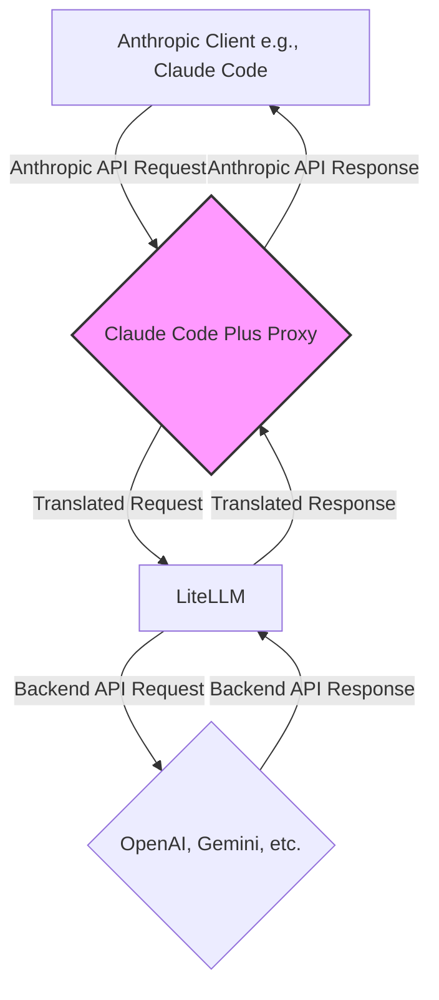

# 🚀 Claude Code Plus: Use Any Model with Your Favorite Anthropic Tools

**Unlock the full potential of your development workflow. Use Anthropic clients like Claude Code with any backend model from OpenAI, Google, or other providers via LiteLLM.**

[](https://github.com/BotNexusAI/claude-code-plus)
[](https://www.python.org/downloads/)
[](LICENSE)

---

## ✨ Why Use Claude Code Plus?

Claude Code Plus acts as a powerful translation layer, allowing you to:

- **Break Vendor Lock-in:** Use your favorite Anthropic-compatible clients (like the Claude Code CLI) with more powerful or cost-effective models from OpenAI, Google, and beyond.
- **Access the Best Models:** Seamlessly switch to the latest models like GPT-4.1 or Gemini 2.5 Pro without changing your client-side workflow.
- **Maintain Your Tools:** Keep using the development tools you love, while gaining the flexibility to choose your backend model.
- **Full Tool Support:** Enhanced compatibility for tool usage, including automatic schema cleaning for Gemini models.
- **Easy Setup:** Get started in minutes with an interactive command-line wizard.

---

## 🧩 How It Works

The proxy server intercepts requests from your Anthropic client, translates them to the format of your chosen backend (e.g., OpenAI, Gemini), sends the request, and then translates the response back into the Anthropic format.



---

## ⚡ Quick Start

### Prerequisites
- Python 3.10+

### Installation & Setup

1.  **Clone the Repository:**
    ```bash
    git clone https://github.com/BotNexusAI/claude-code-plus.git
    cd claude-code-plus
    ```

2.  **Install Dependencies:**
    This will also make the `ccp` command available in your shell.
    ```bash
    pip install -e .
    ```

3.  **Run the Initialization Wizard:**
    This interactive command sets up your API keys and model preferences in a `.env` file.
    ```bash
    ccp init
    ```

4.  **Start the Server:**
    By default, the server runs in the background.
    ```bash
    ccp start
    ```
    Your proxy is now running at `http://localhost:PORT` (e.g., `http://localhost:8082` by default).

---

## 🎮 Using with Claude Code

1.  **Install Claude Code:**
    ```bash
    npm install -g @anthropic-ai/claude-code
    ```

2.  **Connect to Your Proxy:**
    The `ccp init` command (Step 3 in Quick Start) will offer to automatically add the `ANTHROPIC_BASE_URL` to your shell configuration file (`.zshrc` or `.bashrc`). **This is the recommended method.**

    If you choose to set it manually, you can do so with the following command:
    ```bash
    export ANTHROPIC_BASE_URL=http://localhost:PORT
    ```
    (Replace `PORT` with the port you configured during `ccp init`.)
    *Tip: If you set this manually, add the line to your `.zshrc` or `.bashrc` file to make the setting permanent.*

3.  **Done!**
    After restarting your shell (or running `source ~/.zshrc`), you can use Claude Code as you normally would, and it will route requests through your configured backend model.
    ```bash
    claude "Hello, world!"
    ```

---

## 💻 CLI Commands

Manage the proxy with these simple commands:

| Command | Description |
| :--- | :--- |
| `ccp init` | 🧙‍♂️ Run the interactive wizard to set up API keys and model preferences. |
| `ccp start` | ▶️ Start the server. Use `-f` or `--foreground` to run in the foreground. |
| `ccp stop` | ⏹️ Stop the background server process. |
| `ccp logs` | 📄 Tail the log file (`.ccp.log`) for the background server. |
| `ccp config`| ⚙️ Display the current configuration from your `.env` file. |

---

## 🛠️ Configuration & Model Mapping

Customize the proxy's behavior by editing the `.env` file created by `ccp init`.

| Variable | Description | Default |
| :--- | :--- | :--- |
| `OPENAI_API_KEY` | **(Required)** Your OpenAI API key. | - |
| `GEMINI_API_KEY` | **(Required)** Your Google AI Studio (Gemini) API key. | - |
| `PORT` | The port for the proxy server to run on. | `8082` |
| `PREFERRED_PROVIDER`| The primary backend for mapping models (`openai` or `google`). | `openai` |
| `BIG_MODEL` | The model to map `sonnet` requests to. | `gpt-4.1` |
| `SMALL_MODEL` | The model to map `haiku` requests to. | `gpt-4.1-mini` |
| `ANTHROPIC_API_KEY`| Your Anthropic API key (only if proxying *to* Anthropic). | - |

**Example: Prefer Google Models**
```bash
# .env file
PREFERRED_PROVIDER="google"
BIG_MODEL="gemini-2.5-pro"
SMALL_MODEL="gemini-2.5-flash"
```

The proxy automatically prefixes models with `openai/` or `gemini/` based on your `PREFERRED_PROVIDER`.

---

## 🧪 Running Tests

To run the test suite, first set up your `.env` file with `ccp init`, then run:

```bash
pytest
```

---

## 🤝 Contributing

Contributions are welcome! Please feel free to submit a Pull Request.

---
