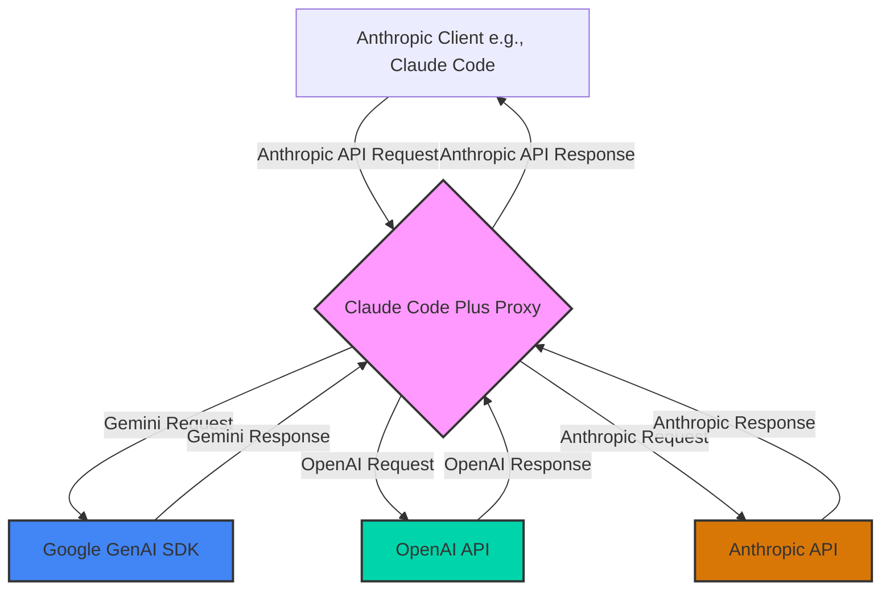

# Architecture: Direct API Integration (No LiteLLM)

This document outlines the new modular architecture of the Claude Code Plus proxy, explaining how it directly translates requests and responses between an Anthropic-compatible client (like Claude Code) and backend model providers (Google Gemini, OpenAI, and Anthropic) using native APIs.

## 1. Overall Architecture

The proxy server acts as a modular middleware that intercepts API requests from the Anthropic client. It routes requests to specialized handlers that communicate directly with each provider's native API, then translates responses back into the format the Anthropic client expects.

## 2. Modular Structure

The new architecture is organized into focused modules:

### Core Components
- **`src/ccp/server.py`:** Main FastAPI application with request routing logic
- **`src/ccp/models.py`:** Pydantic models for request/response validation
- **`src/ccp/config.py`:** Configuration management and API client initialization
- **`src/ccp/utils.py`:** Shared utilities, logging, and helper functions

### Provider Handlers
- **`src/ccp/handlers/gemini.py`:** Direct Google GenAI SDK integration
- **`src/ccp/handlers/openai.py`:** Direct OpenAI API calls via httpx
- **`src/ccp/handlers/anthropic.py`:** Direct Anthropic API calls

### Format Conversions
- **`src/ccp/conversions/genai.py`:** Anthropic ↔ Google GenAI format translation
- **`src/ccp/conversions/openai.py`:** Anthropic ↔ OpenAI format translation
- **`src/ccp/conversions/anthropic.py`:** Anthropic format validation/passthrough

### Streaming Support
- **`src/ccp/streaming/gemini.py`:** Google GenAI streaming to Anthropic SSE
- **`src/ccp/streaming/openai.py`:** OpenAI streaming to Anthropic SSE
- **`src/ccp/streaming/anthropic.py`:** Anthropic streaming passthrough

## 3. Request Lifecycle & Model Mapping

The process begins when the proxy receives a request at the `/v1/messages` endpoint.

1.  **Request Validation:** The incoming JSON request is parsed and validated by the `MessagesRequest` Pydantic model in `src/ccp/models.py`.
2.  **Model Mapping:** The `model` field undergoes transformation within the `validate_model_field` validator:
    - Maps "haiku" and "sonnet" models to `SMALL_MODEL` and `BIG_MODEL` based on `PREFERRED_PROVIDER`
    - Automatically adds provider prefixes (`openai/`, `gemini/`, `anthropic/`)
    - Example: `claude-3-sonnet` → `gemini/gemini-2.0-flash` (if Google is preferred)
3.  **Request Routing:** The main server routes requests based on model prefixes:
    - `gemini/*` → `handle_gemini_request()` in `handlers/gemini.py`
    - `openai/*` → `handle_openai_request()` in `handlers/openai.py`
    - `anthropic/*` → `handle_anthropic_request()` in `handlers/anthropic.py`
4.  **Format Conversion:** Each handler uses provider-specific conversion functions to translate the request format.

## 4. Provider-Specific Handling

### Google Gemini (via GenAI SDK)
- **Handler:** `src/ccp/handlers/gemini.py`
- **Conversion:** `src/ccp/conversions/genai.py`
- **Features:**
  - Direct Google GenAI SDK integration
  - Automatic schema cleaning for tool definitions
  - Native streaming support
  - System prompt handling via content prepending

### OpenAI (Direct API)
- **Handler:** `src/ccp/handlers/openai.py`
- **Conversion:** `src/ccp/conversions/openai.py`
- **Features:**
  - Direct API calls via httpx
  - Streaming via Server-Sent Events
  - Full tool calling support
  - Native OpenAI format compatibility

### Anthropic (Direct API)
- **Handler:** `src/ccp/handlers/anthropic.py`
- **Conversion:** `src/ccp/conversions/anthropic.py`
- **Features:**
  - Direct Anthropic API calls
  - Minimal format translation (mostly passthrough)
  - Native streaming support
  - Full feature compatibility

## 5. Tool Call Translation

Tool calling is handled by provider-specific conversion functions:

### Anthropic → Backend
- **OpenAI:** Converts `tools` array with `input_schema` to OpenAI `function` format
- **Gemini:** Uses GenAI SDK's `types.FunctionDeclaration` with automatic schema cleaning
- **Anthropic:** Direct passthrough with validation

### Backend → Anthropic
- **OpenAI:** Converts `tool_calls` array to Anthropic `tool_use` content blocks
- **Gemini:** Converts `function_call` parts to Anthropic `tool_use` format
- **Anthropic:** Direct passthrough

## 6. Streaming Architecture

Each provider has dedicated streaming handlers:

- **Gemini Streaming:** `src/ccp/streaming/gemini.py` converts GenAI streaming chunks to Anthropic SSE format
- **OpenAI Streaming:** `src/ccp/streaming/openai.py` converts OpenAI SSE to Anthropic SSE format  
- **Anthropic Streaming:** `src/ccp/streaming/anthropic.py` provides direct passthrough

All streaming implementations emit standard Anthropic events: `message_start`, `content_block_start`, `content_block_delta`, `content_block_stop`, and `message_stop`.

## 7. Configuration

The modular architecture is controlled by variables in the `.env` file:

| Variable             | Description                                                              |
| -------------------- | ------------------------------------------------------------------------ |
| `PREFERRED_PROVIDER` | The primary backend (`openai`, `google`, or `anthropic`) for mapping models. |
| `BIG_MODEL`          | The model to map `sonnet` requests to (e.g., `gpt-4.1`, `gemini-2.0-flash`). |
| `SMALL_MODEL`        | The model to map `haiku` requests to (e.g., `gpt-4.1-mini`, `gemini-2.0-flash`). |
| `OPENAI_API_KEY`     | Your OpenAI API key (required for OpenAI models).                       |
| `GEMINI_API_KEY`     | Your Google AI Studio (Gemini) API key (required for Gemini models).    |
| `ANTHROPIC_API_KEY`  | Your Anthropic API key (required for Anthropic models).                 |
| `PORT`               | The port for the proxy server.                                           |

## 8. Benefits of the New Architecture

### 🚀 **Performance**
- **Reduced Latency:** Direct API calls eliminate LiteLLM abstraction overhead
- **Native Streaming:** Each provider uses its optimal streaming implementation
- **Parallel Processing:** Modular handlers can be optimized independently

### 🔧 **Maintainability**
- **Single Responsibility:** Each module has a focused, clear purpose
- **Easy Testing:** Individual handlers and conversions can be tested in isolation
- **Debugging:** Clear separation makes troubleshooting more straightforward

### 🔄 **Extensibility**
- **Add New Providers:** Simply create new handler/conversion/streaming modules
- **Provider-Specific Features:** Each handler can leverage unique API capabilities
- **Future-Proof:** Easy to adapt when APIs change or new features are released

### 🛡️ **Reliability**
- **Provider Isolation:** Issues with one provider don't affect others
- **Direct Error Handling:** Native error responses from each API
- **Reduced Dependencies:** Fewer external packages mean fewer potential failure points