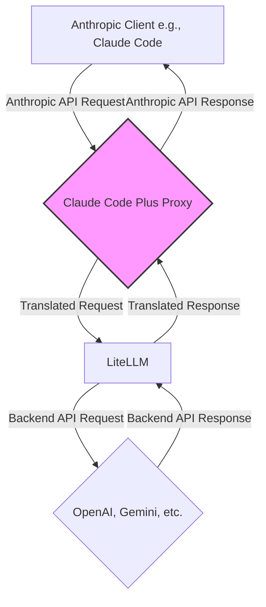

# Architecture: Mapping Anthropic to Gemini/OpenAI

This document outlines the architecture of the Claude Code Plus proxy, explaining how it translates requests and responses between an Anthropic-compatible client (like Claude Code) and a backend model provider (like Google Gemini or OpenAI) via LiteLLM.

## 1. Overall Architecture

The proxy server acts as a middleware that intercepts API requests from the Anthropic client. It performs a series of transformations to make them compatible with the target backend model and then translates the backend's response back into the format the Anthropic client expects.

The key components are:
- **FastAPI Server (`src/ccp/server.py`):** The core of the proxy. It exposes a `/v1/messages` endpoint that mimics Anthropic's API.
- **Pydantic Models:** Used for request validation and data manipulation. The `MessagesRequest` model is central to this process.
- **LiteLLM:** The translation layer that handles communication with various backend model APIs (OpenAI, Gemini, etc.).
- **Conversion Functions:**
    - `convert_anthropic_to_litellm`: Translates the incoming Anthropic request format to the OpenAI format that LiteLLM expects.
    - `convert_litellm_to_anthropic`: Translates the backend model's response back into the Anthropic format.

## 2. Request Lifecycle & Model Mapping

The process begins when the proxy receives a request at the `/v1/messages` endpoint.

1.  **Request Validation:** The incoming JSON request is parsed and validated by the `MessagesRequest` Pydantic model.
2.  **Model Mapping:** The `model` field in the request undergoes a critical transformation within a `field_validator`:
    - It checks the requested model name (e.g., `claude-3-haiku-20240307`).
    - Based on the `PREFERRED_PROVIDER` setting in your `.env` file, it maps "haiku" and "sonnet" models to the `SMALL_MODEL` and `BIG_MODEL` variables, respectively.
    - For example, if `PREFERRED_PROVIDER` is "google" and `BIG_MODEL` is "gemini-1.5-pro-latest", a request for "sonnet" will be mapped to `gemini/gemini-1.5-pro-latest`.
    - The validator automatically adds the correct provider prefix (`openai/` or `gemini/`) for LiteLLM.
    - This logic is defined in the `validate_model_field` validator within the [`MessagesRequest`](src/ccp/server.py:201) model.

## 3. Tool Call Translation: Anthropic to Backend

This is a crucial step for enabling tool use with non-Anthropic models. The translation is handled by the [`convert_anthropic_to_litellm`](src/ccp/server.py:413) function.

1.  **Tool Conversion:** The `tools` array in the Anthropic request, which contains tool definitions with an `input_schema`, is converted into the OpenAI-compatible format. Each tool becomes a dictionary with `type: "function"` and a `function` object containing the name, description, and parameters.

2.  **Gemini Schema Cleaning:** Google's Gemini models have stricter requirements for their tool schemas than OpenAI or Anthropic. To ensure compatibility, a special cleaning function, [`clean_gemini_schema`](src/ccp/server.py:125), is invoked if the target model is a Gemini model. This function recursively traverses the `input_schema` and:
    - Removes unsupported fields like `additionalProperties` and `default`.
    - Removes unsupported `format` values from string types (e.g., `uuid`), which would otherwise cause errors.

3.  **Tool Choice:** The `tool_choice` parameter is also translated from Anthropic's format (e.g., `{type: "tool", name: "my_tool"}`) to the format expected by the backend (e.g., `{type: "function", function: {name: "my_tool"}}`).

## 4. Tool Call Translation: Backend to Anthropic

After the backend model returns a response, the [`convert_litellm_to_anthropic`](src/ccp/server.py:630) function translates it back.

1.  **Tool Call Detection:** The function checks the response for a `tool_calls` field, which is how OpenAI and Gemini indicate that the model wants to use a tool.

2.  **Response Conversion:** Each item in the `tool_calls` array is converted into an Anthropic `tool_use` content block.
    - The `id` from the backend tool call is preserved.
    - The `function.name` becomes the `name` of the tool.
    - The `function.arguments` (which is a JSON string) is parsed into a dictionary and becomes the `input` for the tool.

3.  **Content Assembly:** The final response sent to the client is a list of content blocks. If the model generates both text and tool calls, the response will contain both a `text` block and one or more `tool_use` blocks, just as the Anthropic client expects.

## 5. Streaming

The proxy fully supports streaming responses to provide real-time output in the client.

1.  **Initiating Stream:** If the initial request has `stream: true`, the proxy calls LiteLLM's `acompletion` function, which returns an asynchronous generator.
2.  **Event Translation:** The `handle_streaming` async generator function iterates over the chunks from the LiteLLM response and translates them into Anthropic's server-sent events (SSE) format.
    - It sends `message_start`, `content_block_start`, `content_block_delta`, `content_block_stop`, and `message_stop` events to mimic the behavior of Anthropic's native API.
    - This ensures that text and tool calls appear incrementally in the client, providing a seamless user experience.

## 6. Configuration

The entire translation process is controlled by variables in the `.env` file:

| Variable             | Description                                                              |
| -------------------- | ------------------------------------------------------------------------ |
| `PREFERRED_PROVIDER` | The primary backend (`openai` or `google`) for mapping models.           |
| `BIG_MODEL`          | The model to map `sonnet` requests to (e.g., `gpt-4.1`, `gemini-1.5-pro`). |
| `SMALL_MODEL`        | The model to map `haiku` requests to (e.g., `gpt-4.1-mini`, `gemini-1.5-flash`). |
| `OPENAI_API_KEY`     | Your OpenAI API key.                                                     |
| `GEMINI_API_KEY`     | Your Google AI Studio (Gemini) API key.                                  |
| `PORT`               | The port for the proxy server.                                           |